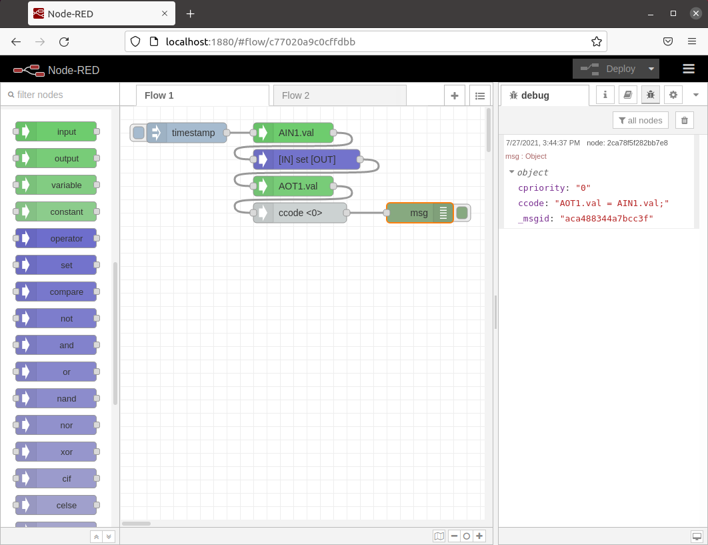
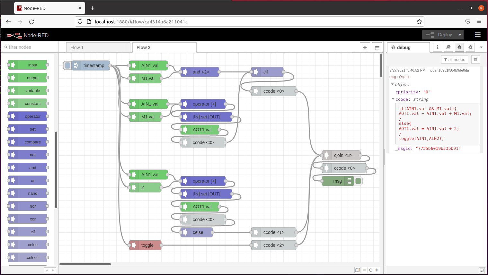

# Node-Red-Graphical-Editor

This is an application that generates C code with graphical programming. Please check https://github.com/FieryElectron/Graphical-C-Editor-Master-Project for better approach.

## Deployment steps

cd to node-red-contrib

    sudo npm link

    cd ~/.node-red/
    
    npm link node-red-contrib

## Simple Flow

## Complex Flow

